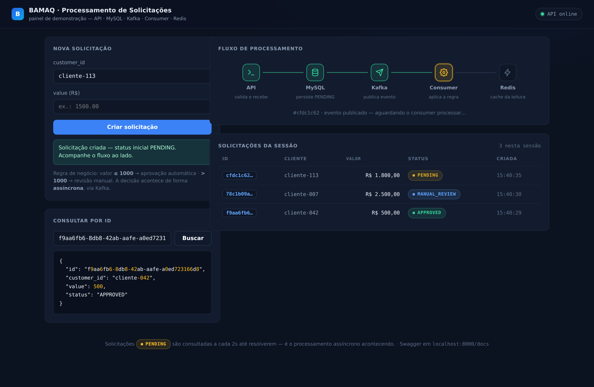

# Processamento Assíncrono de Solicitações

**Desafio Técnico — BAMAQ Capital**


API que recebe solicitações de processamento, persiste em MySQL, publica eventos no Kafka
para processamento assíncrono e serve consultas com cache Redis — organizada em
**Arquitetura Hexagonal** (Ports & Adapters), com idempotência em duas camadas,
retry com backoff, DLQ e segurança levada a sério.

---

## Índice

- [Arquitetura (Parte 1 — System Design)](#arquitetura-parte-1--system-design)
- [Como rodar](#como-rodar)
- [Demo visual](#demo-visual)
- [Endpoints e exemplos](#endpoints-e-exemplos)
- [Como rodar os testes](#como-rodar-os-testes)
- [Estrutura do projeto](#estrutura-do-projeto)
- [Decisões técnicas](#decisões-técnicas)
- [Tratamento de falhas](#tratamento-de-falhas)
- [Segurança](#segurança)
- [Evoluções mapeadas](#evoluções-mapeadas)

---

## Arquitetura (Parte 1 — System Design)



*Fonte editável em [`docs/architecture.mmd`](docs/architecture.mmd); exports em
[SVG](docs/architecture.svg) e [PNG](docs/architecture.png).*

**Fluxo de criação** (números no diagrama): o cliente faz `POST /requests` →
a API valida (Pydantic), cria a entidade no domínio, **persiste no MySQL com
status `PENDING`** e só então **publica o evento** no tópico `request-processing`
(chave = `request_id`, `acks=all`, flush síncrono) → responde `201` com o id.

**Fluxo de processamento**: o consumer (processo separado, mesmo código) consome o
evento, relê o estado atual no MySQL, aplica a regra
(`value <= 1000 → APPROVED`, `> 1000 → MANUAL_REVIEW`), grava via
**UPDATE condicional** (`WHERE status='PENDING'`), **invalida o cache** no Redis e
commita o offset — nessa ordem.

**Fluxo de consulta**: `GET /requests/{id}` usa **cache-aside** — Redis primeiro;
miss → MySQL → popula o cache com TTL de 5 min; `404` se não existir.

**Onde cada tecnologia entra e por quê:**

| Tecnologia | Papel | Por quê |
|---|---|---|
| **MySQL** | Fonte da verdade | Estado das solicitações exige durabilidade e transação; `DECIMAL(15,2)` para dinheiro exato |
| **Kafka** | Desacoplamento temporal | A API responde rápido e o processamento acontece quando o consumer puder; partições dão paralelismo com ordem por solicitação |
| **Redis** | Acelerador de leitura | Reduz SELECTs repetidos; é **descartável** — perdê-lo degrada latência, nunca corrompe dado |
| **SQLAlchemy** | Acesso a dados | Queries 100% parametrizadas + o domínio não conhece SQL |

**Camadas** (domínio / aplicação / infraestrutura): ver [Decisões técnicas](#decisões-técnicas).

---

## Como rodar

Pré-requisitos: Docker + Docker Compose.

```bash
git clone https://github.com/gabriellef1/bamaq-challenge.git
cd bamaq-challenge

# 1. Configura o ambiente (o .env NÃO é versionado)
cp .env.example .env   # revise as senhas se quiser

# 2. Sobe tudo: MySQL, Kafka (KRaft), Redis, API e consumer
docker compose up -d --build

# 3. Acompanha até ficar saudável (~40s na primeira vez)
docker compose ps
docker compose logs -f api consumer
```

A API fica em `http://localhost:8000` (Swagger em `/docs`).
Para derrubar: `docker compose down -v`.

---

## Demo visual



Painel estático em [`demo/index.html`](demo/index.html) (arquivo único, sem build e sem
framework) que mostra o fluxo assíncrono acontecendo: cria solicitações, acompanha as
`PENDING` com polling de 2s até resolverem, destaca as etapas
API → MySQL → Kafka → Consumer → Redis e consulta por id com o JSON formatado.

**Como usar**: com a stack rodando (`docker compose up -d`), abra `demo/index.html`
direto no navegador. Se o seu navegador bloquear chamadas a partir de `file://`,
sirva a pasta localmente e acesse `http://localhost:8080`:

```bash
python3 -m http.server 8080 -d demo
```

O CORS da API está liberado **apenas** para `localhost`/`127.0.0.1` e para a origem
`null` (página aberta via `file://`), sem credenciais — existe só para esta demo local
(ver comentário em `src/app/composition/api.py`).

---

## Endpoints e exemplos

### `POST /requests` — cria uma solicitação

```bash
curl -i -X POST localhost:8000/requests \
  -H 'content-type: application/json' \
  -d '{"customer_id": "123", "value": 500.00}'
```

```http
HTTP/1.1 201 Created
location: /requests/90c151b3-937e-47ce-b6a4-9cb4a8e9fdd8

{"id":"90c151b3-937e-47ce-b6a4-9cb4a8e9fdd8","customer_id":"123","value":500.0,"status":"PENDING"}
```

### `GET /requests/{id}` — consulta o estado atual

Instantes depois, o consumer já processou (`500 <= 1000`):

```bash
curl -s localhost:8000/requests/90c151b3-937e-47ce-b6a4-9cb4a8e9fdd8
```

```json
{"id": "90c151b3-937e-47ce-b6a4-9cb4a8e9fdd8", "customer_id": "123", "value": 500.0, "status": "APPROVED"}
```

Com `value = 1500.00`, o mesmo fluxo termina em `MANUAL_REVIEW`:

```json
{"id": "0b292176-2e83-4387-a1d9-e24fb7a5d93d", "customer_id": "123", "value": 1500.0, "status": "MANUAL_REVIEW"}
```

### Erros

```bash
# id inexistente -> 404
curl -s -w '\n-> HTTP %{http_code}\n' localhost:8000/requests/00000000-0000-0000-0000-00000000dead
# {"detail":"solicitação não encontrada: 00000000-0000-0000-0000-00000000dead"}
# -> HTTP 404

# payload inválido -> 422 (value negativo, customer_id fora da whitelist, campo extra...)
curl -s -o /dev/null -w '%{http_code}\n' -X POST localhost:8000/requests \
  -H 'content-type: application/json' -d '{"customer_id": "a b", "value": -5}'
# 422
```

| Código | Quando |
|---|---|
| `201` | Criada, persistida e evento confirmado no broker |
| `404` | Id não existe |
| `413` | Corpo maior que 16 KB |
| `422` | Payload viola o contrato (tipos, `value <= 0`, campo extra, id malformado) |
| `429` | Rate limit (10/min escrita, 60/min leitura, por IP) |
| `503` | MySQL fora **ou** Kafka não confirmou o evento (neste caso a linha fica `PENDING` e o header `Retry-After` orienta o retry) |

---

## Como rodar os testes

Os testes **não precisam de Docker** — o domínio é puro e a integração usa fakes das ports:

```bash
pip install -e ".[dev]"
pytest -m "not e2e"            # 97 testes, ~1s
pytest -m "not e2e" --cov      # com cobertura (85%)
ruff check src tests           # lint + regras de segurança (bandit)
```

O que está coberto: máquina de estados exaustiva, fronteira da regra
(`1000.00` inclusive), invariantes da entidade, contrato da API (201/404/413/422/429/503),
**idempotência do consumer em 3 níveis**, retry/backoff/DLQ, cache-aside
(hit sem tocar no banco), resiliência do adapter Redis e o CAS do repositório.
Um teste de *fitness arquitetural* lê a AST e **reprova import de infraestrutura
dentro de `domain/` e `application/`**.

---

## Estrutura do projeto

```
src/app/
├── domain/            # Entidade, máquina de estados, regra — SÓ stdlib
├── application/
│   ├── ports/         # Contratos (Protocol): repositório, publisher, cache
│   └── use_cases/     # CreateRequest, GetRequest, ProcessRequestEvent, MarkRequestAsFailed
├── adapters/
│   ├── inbound/       # http (FastAPI) e messaging (consumer Kafka)
│   ├── outbound/      # persistence (SQLAlchemy), messaging (producer/DLQ), cache (Redis)
│   └── shared/        # contrato de fio dos eventos (versão de schema)
├── config/            # settings (pydantic-settings) e logging estruturado
└── composition/       # composition roots: api.py e consumer.py (a DI acontece aqui)
```

A regra das setas: **imports só apontam para dentro** (`adapters → application → domain`).
Os dois composition roots são o único lugar que conhece as pontas concretas — a API e o
consumer usam os **mesmos** casos de uso e adapters outbound, mudando só o adapter de entrada.

---

## Decisões técnicas

### Arquitetura hexagonal
Ports como `typing.Protocol` (tipagem estrutural, verificada por mypy) em vez de ABC:
o adapter implementa o contrato por ter os métodos certos, sem herdar nada.
O custo da separação (um modelo ORM espelho + mapper de ~20 linhas) compra:
testes de regra sem infra, troca de tecnologia sem tocar no domínio, e dois
drivers (HTTP e Kafka) sobre a mesma aplicação.
*Alternativa*: acoplar entidade ao ORM — menos código, mas o domínio passa a depender do banco.

### Idempotência (mesma mensagem, duas entregas)
Kafka garante **at-least-once** (commit manual de offset *após* processar), então duplicata é
fato da vida. Duas camadas independentes:
1. **Máquina de estados** — `PENDING` é o único estado não-terminal; reprocessar uma
   solicitação finalizada é pulado (`SKIPPED`). Cobre a duplicata sequencial.
2. **Compare-and-set no MySQL** — `UPDATE ... WHERE id=? AND status='PENDING'` num único
   statement atômico. Cobre a corrida real: duas instâncias do consumer processando a mesma
   mensagem ao mesmo tempo (rebalance) — só uma vê `rowcount=1`.

*Alternativa*: tabela de mensagens processadas (inbox) — necessária se o processamento não
fosse expressável como transição de estado; aqui seria redundante.

### Cache (invalidação por DELETE, não write-through)
O consumer **apaga** a chave após gravar no MySQL; o próximo GET repovoa do banco.
Escolhido porque nunca serve dado velho por decisão própria: a fonte da verdade é uma só.
O TTL (5 min) é rede de segurança para o caso raro de a invalidação falhar (Redis
indisponível no momento do DELETE), não o mecanismo principal.
*Alternativa*: write-through (consumer grava o novo estado no Redis) — pouparia um miss,
mas cria dupla escrita: se a do Redis falhar após a do MySQL, o cache serve dado velho até o TTL.
404 **não** é cacheado (evita "404 grudado"); negative caching com TTL curto seria a evolução
se ids inexistentes viressem ataque.

### Cache é best-effort por contrato
A port `RequestCache` define: erro de infraestrutura vira miss/no-op logado — Redis fora do ar
**degrada a latência, nunca derruba o GET** (validado na prática: MySQL pausado + cache quente
respondeu em 3ms; Redis morto + MySQL vivo responde normal). Timeouts de 500ms: esperar um
Redis lento seria pior do que ir direto ao MySQL.

### Evento magro (notification pattern)
O evento carrega só `request_id` + `schema_version`. O consumer relê o banco — que ele já
precisaria ler para a idempotência — e nunca processa dado defasado de um evento atrasado.
*Alternativa*: evento gordo (dados de carona) pouparia um SELECT; vale quando o consumer não
tem acesso ao banco do produtor.

### Persistir antes de publicar (e o trade-off honesto)
Se o Kafka falhar após o INSERT, o cliente recebe `503` e fica uma linha `PENDING` honesta —
auditável e reprocessável. A janela inversa (evento sem linha) seria pior: o consumer falharia
sempre. A garantia total seria **Transactional Outbox** (evento gravado na mesma transação e
publicado por um relay) — mapeada como evolução, desnecessária neste escopo.

### KRaft, partições e ordem
Kafka 3.9 em KRaft: Zookeeper está deprecado e foi removido no Kafka 4.0 — um container a
menos e o modo atual. `request-processing` tem **3 partições** com **chave = request_id**:
eventos da mesma solicitação caem na mesma partição (ordem garantida onde importa) e o
consumo escala até 3 instâncias (`docker compose up -d --scale consumer=3`).
Tópicos criados explicitamente pelo `kafka-init` (auto-criação desligada): número de
partições é decisão de arquitetura, não acidente de runtime.

### Síncrono, não async
Endpoints `def` (threadpool do FastAPI) e adapters síncronos: **uma** implementação de cada
adapter serve API e consumer (confluent-kafka é síncrono). Async exigiria adapters duplicados
(`aiomysql`, `redis.asyncio`) — seria a escolha certa em throughput muito alto, não aqui.

---

## Tratamento de falhas

| Falha | Comportamento |
|---|---|
| Payload inválido | `422` na borda; nada toca banco ou broker |
| MySQL fora (API) | `503` + `Retry-After`, mensagem genérica (detalhe só no log) |
| Kafka fora (API) | `503`; linha fica `PENDING` (persistir-antes-de-publicar) |
| Redis fora | GET degrada para MySQL; consumer segue (invalidação vira no-op logado, TTL cobre) |
| MySQL fora (consumer) | Retry com backoff exponencial + full jitter (0.5s → 10s, 3 retries) |
| Falha persistente | Marca `FAILED` (cliente enxerga o desfecho) + arquiva na **DLQ** com payload intacto e headers de diagnóstico (`dlq.error`, `dlq.attempts`, origem, timestamp) |
| Payload corrompido no tópico | Não-retryável: DLQ **imediata** (não trava a partição atrás de retry inútil) |
| Até a DLQ falhou | Processo morre **sem commitar** o offset; o supervisor reinicia e a mensagem é relida — perder mensagem é pior que reiniciar |
| Queda no meio do processamento | Offset não commitado → mensagem relida → idempotência absorve |
| Boot com dependências lentas | Healthchecks ordenam o compose; a API ainda faz retry do DDL no startup |

---

## Segurança

Defesa em profundidade — nenhuma camada confia que a anterior segurou tudo.
Detalhes completos em [`docs/security.md`](docs/security.md).

| Medida | Onde | O que previne |
|---|---|---|
| Validação rigorosa (Pydantic): `extra="forbid"`, whitelist `[A-Za-z0-9_-]` no `customer_id`, `Decimal` sem passar por float, `decimal_places=2` rejeita (não arredonda) | `http/schemas.py` + invariantes na entidade | Mass assignment, log injection, corrupção monetária |
| Zero secrets no código/repos: env vars validadas no boot, `SecretStr`, senha URL-escapada, `.env` fora do git e da imagem | `config/settings.py` | Vazamento de credencial |
| Queries 100% parametrizadas (expression language, zero SQL raw) | `persistence/repository.py` | SQL injection — por construção, não por escape |
| Containers non-root (uid 1000, `nologin`), multi-stage, MySQL com usuário dedicado | `Dockerfile`, compose | Escalada pós-comprometimento |
| Rate limiting por IP (10/min POST, 60/min GET) | slowapi | Abuso trivial de um cliente |
| Corpo limitado a 16 KB (Content-Length **e** contagem de chunked) → `413` antes do parse | `http/middleware.py` | DoS de memória barato |
| Headers defensivos (`nosniff`, `no-store`, `X-Frame-Options`) + uvicorn sem header `Server` | middleware / CMD | MIME sniffing, cache indevido, fingerprinting |
| Logs estruturados sem dados de negócio + redação automática (`value`, `customer_id`, `password` → `[REDACTED]`) | `config/logging.py` | Vazamento via log |
| Erros genéricos ao cliente, detalhe real só no log | `http/errors.py` | Vazamento de topologia interna |
| Lint de segurança contínuo (regras bandit do ruff) + teste de fitness arquitetural | CI local | Regressões |

**Débitos assumidos** (com mitigação mapeada em `docs/security.md`): Kafka em PLAINTEXT,
Redis sem senha no compose local, API sem autenticação, `/docs` aberto — escolhas conscientes
para ambiente local de desafio, cada uma com o caminho de produção documentado.

---

## Evoluções mapeadas

Fora do escopo do desafio, mas com o caminho pensado:

- **Transactional Outbox** para eliminar a janela API→Kafka (hoje: 503 + linha PENDING).
- **Alembic** no lugar do `create_all` (migrações versionadas e reversíveis).
- **Reprocessador da DLQ** (consome a DLQ, republica o payload — que já está intacto — no tópico principal).
- **`MANUAL_REVIEW` como estado transitório** (analista aprova/recusa): abrir novas arestas no mapa de transições é a única mudança de domínio.
- **Rate limit com storage Redis** para valer entre réplicas; **auth** (JWT no gateway); **readiness probe** separada do liveness.
- **Async de ponta a ponta** se o throughput justificar adapters duplicados.

---

*Desenvolvido com assistência de IA (Claude), conforme permitido pelo desafio — cada decisão
acima é minha e está defendida nas seções correspondentes.*
